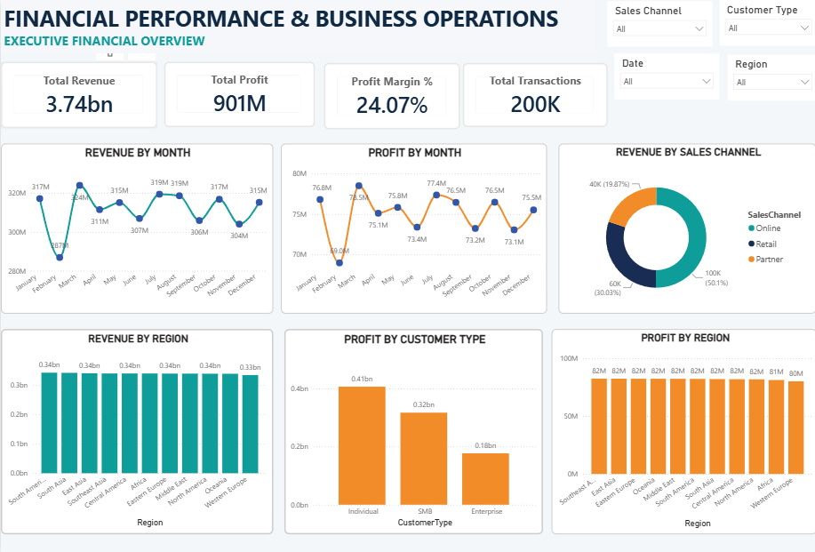
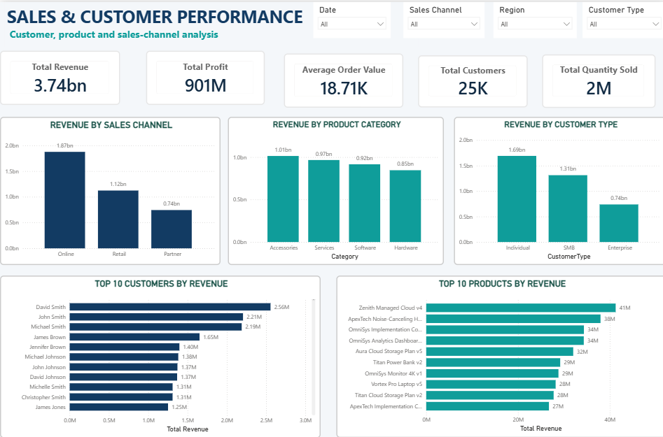
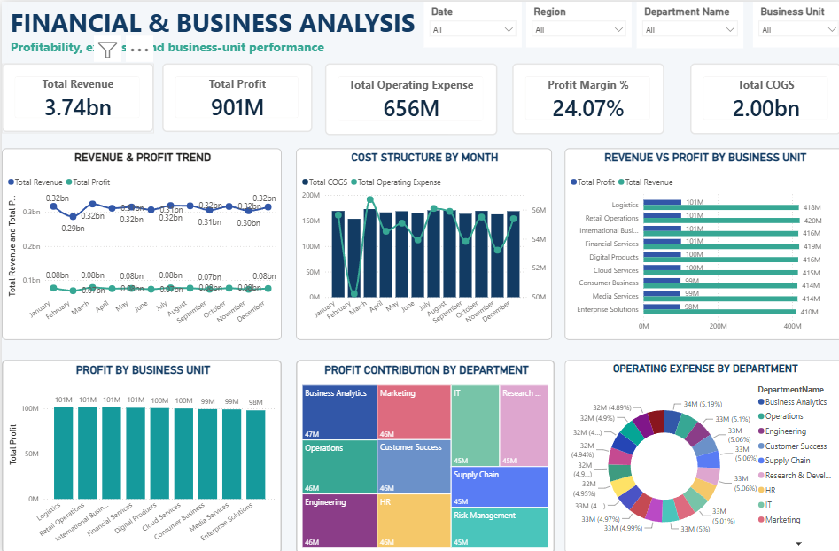
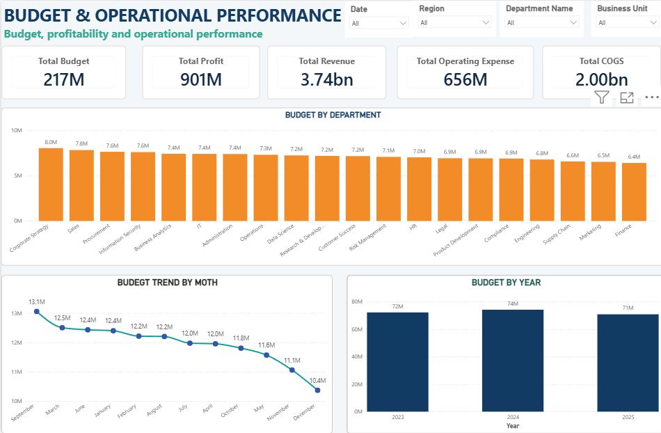

# Financial Performance & Business Operations Analysis

## Project Overview

This project analyzes financial performance and business data using **SQL** and **Power BI**. The analysis focuses on revenue, profit, customer performance, product performance, regional performance, departmental performance, and budget vs. actual results.

## Tools & Technologies

* **SQL** – Data analysis, joins, aggregations, CTEs, subqueries, window functions
* **Power BI** – Interactive dashboards, KPI tracking, financial and business reporting
* **CSV** – Source datasets

## Key Analysis Areas

### Financial Analysis

* Total revenue, profit, and transaction analysis
* Monthly revenue trends
* Revenue and profit by region
* Revenue by sales channel
* Budget vs. actual analysis

### Customer Analysis

* Customer transaction and revenue analysis
* Top customers by revenue
* Customer ranking and contribution

### Product Analysis

* Product-level revenue and profit analysis
* Top-performing products
* Product category performance

### Business Analysis

* Department-level revenue and profit
* Business unit performance
* Regional performance
* Monthly revenue growth analysis

## Power BI Dashboard

The Power BI dashboard provides an interactive view of the financial and business performance analysis, including KPIs, revenue and profit trends, customer performance, regional analysis, and budget comparisons.

### Dashboard Screenshots

#### Executive Summary



#### Sales & Customer Performance



#### Financial & Business Analysis



#### Budget & Operations



## SQL Analysis

The SQL analysis contains queries covering financial performance, customer analysis, product analysis, regional analysis, departmental analysis, budget vs. actual performance, customer ranking, and monthly revenue growth.

The SQL work includes **JOINs, aggregations, CASE statements, CTEs, subqueries, RANK(), and LAG()**.

## Repository Structure

```text
Financial-Performance-Business-Operations/
│
├── Data/
│   ├── Budget.csv
│   ├── Business_Units.csv
│   ├── Calendar.csv
│   ├── Customers.csv
│   ├── Departments.csv
│   ├── Employees.csv
│   ├── Financial_Transactions.csv
│   ├── Products.csv
│   └── Regions.csv
│
├── PowerBI/
│   └── Financial_Performance_Business_Operations.pbix
│
├── SQL/
│   └── Finance_and_Business_OPS.sql
│
├── Screenshots/
│   ├── Executive-Summary.png
│   ├── Sales-Customer-Performance.png
│   ├── Financial-Business-Analysis.png
│   └── Budget-Operations.png
│
└── README.md
```

## Project Focus

**Financial Analysis | Business Analysis | SQL | Power BI | Data Visualization | KPI Reporting**
